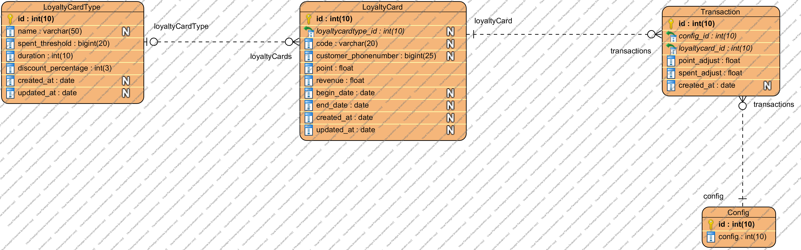

# sapo-home-test
project có 2 endpoint: /api/config & /api/transaction.

## Yc 1: endpoint /api/config
Sử dụng Http client (Postman) gửi request đến endpoint /api/config:
- nếu là POST request thì cần gửi kèm tham số có định dạng {value:xxx} với value là post param, còn xxx là giá trị của config. Api sẽ lấy thông tin này để tạo 1 bản ghi cấu hình mới.
- nếu là GET request thì api sẽ trả lại danh sách các config có trong database.

## Yc2: endpoint /api/transaction
Sử dung Http client(Postman) gửi request đến endpoint /api/transaction:
- nếu là POST request thì cần gửi kèm tham số có định dạng {cardId:xxx, spentAdjust:yyy} trong đó xxx là id của thẻ khách hàng và yyy là doanh thu của giao dịch. Api sẽ lấy thông tin này để tạo 1 bản ghi transaction mới, đồng thời cập nhật doanh thu cho thẻ và cập nhật hạng thẻ nếu như hạng thẻ có sự thay đổi.
- nếu là GET request thì api sẽ trả lại danh sách các transaction có trong database.

## Trả lời câu hỏi bổ sung:
> Nếu giao dịch được tổng hợp từ các hệ thống khác và định kỳ được tải lên hệ thống tích điểm, thì xử lý như thế nào trong trường hợp cấu hình quy đổi điểm bị thay đổi giữa các lần giao dịch của khách hàng?

Mỗi khi tạo 1 bản ghi transaction, hệ thống sẽ lấy id của config hiện hành gán vào cho transaction, sau này khi tổng hợp tích điểm thì transaction nào sẽ được tính điểm với config tương ứng.

> Để tăng hiệu năng hệ thống khi có rất nhiều giao dịch của nhiều khách hàng đồng thời thì có giải pháp nào không?

có 2 cách phổ biến:
1. Nâng cấp phần cứng hệ thống. Cách này có ưu điểm là đơn giản và nhanh, tuy nhiên cách này chỉ sử dụng làm giải pháp trước mắt vì nâng cấp phần cứng thì cũng có giới hạn, và hiệu năng cải thiện không tỉ lệ thuận với cấu hình.
2. Nâng cấp kiến trúc hệ thống. Cách này khắc phục được nhược điểm của cách 1 và đáp ứng tốt nhu cầu phục vụ số lượng lớn khách hàng (cải thiện đáng kể hiệu năng hệ thống), tuy nhiên tốn rất nhiều thời gian và chi phí.

## Database schema

